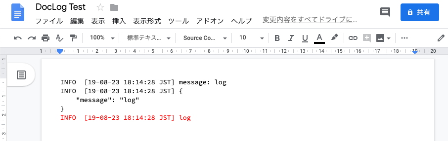

[](https://github.com/google/clasp)  

# DocLog

Google Apps Script用のGoogleドキュメントにログを出力するライブラリ

## スクリプトID

`15Iw-vBLNxIiBV7RDpsAzWxTEVj4KV9-ypRd_IE82OimoyCkZgjX3f-Lz`

## 使い方

### 事前準備

- [ライブラリをプロジェクトに追加する](https://developers.google.com/apps-script/guides/libraries)

### コードサンプル

```js
function myFunction() {
  var log = DocLog.create('GoogleドキュメントのファイルID');
  log.info('message: %s', 'log');

  log.JSON_SPACE = 4;
  log.info({message: 'log'});

  log.INFO = '#FF0000'
  log.info('log');
}
```


